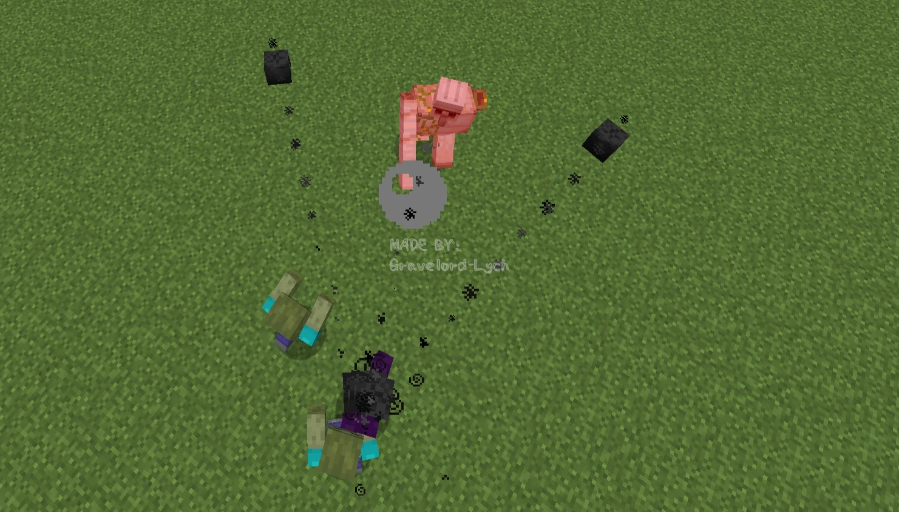
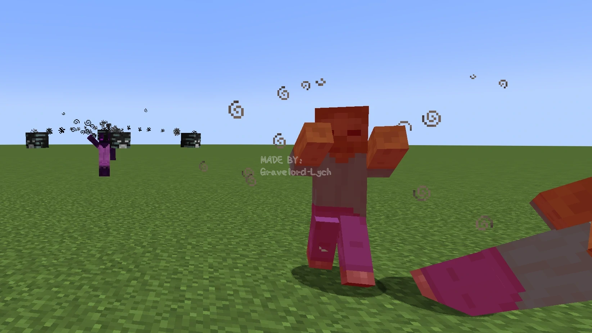

# 实战5 - 亡灵召唤者

这次我们来看看一种令人毛骨悚然的敌对生物吧~

### 任务
**制作一种新的怪物——亡灵召唤者**

---

### 要求
1. 亡灵召唤者的**生命值为30**，其余数值可以任意设置
2. 亡灵召唤者生成时**不携带任何装备**
3. 亡灵召唤者会使用下列两种攻击方式：
    1. 召唤2只**僵尸仆从**加入战斗。不同于普通的僵尸，僵尸仆从会**优先攻击主人（召唤自身的亡灵召唤者）的攻击目标**，**不会在阳光下燃烧**，并且主人误伤自己时**不会反抗主人**。僵尸仆从**没有掉落物**，而**其余的属性与僵尸完全一样**（但音效可以任意设置）。此攻击方式**冷却时间为30s**，冷却时**只能使用第二种攻击方式**。使用此攻击方式前**主手会抬高**，并且在主手处生成**黄绿**色粒子效果（参考HEX颜色代码：#898F61）。
    2. 面向自己的攻击目标**连续发射3次**凋灵之首，**每次发射3个间隔30°**的凋灵之首，每两次发射**间隔0.6秒**。**前两次**发射**不会发射蓝色凋灵之首**，但**第三次**发射时**有可能全部替换为蓝色凋灵之首**，且替换为蓝色凋灵之首的概率在简单、普通、困难模式下分别为**0%**、**1%**、**20%**。此攻击方式**冷却时间为2s**，使用此攻击方式前**主手会抬高**，并且在主手处生成**黑**色粒子效果（参考HEX颜色代码：#101010）。
4. 亡灵召唤者攻击前会**摆出类似唤魔者“施法”的姿势1秒**，但**只有主手**会抬起“施法”。使用两种攻击方式前有**不同的粒子颜色提示**。
5. 亡灵召唤者会**主动攻击玩家和铁傀儡**，也会**优先反击攻击自己的生物**（**包括别的亡灵召唤者**）
6. 亡灵召唤者**会游泳**，空闲时会**四处张望**并**随意走动**
7. 亡灵召唤者的音效、模型、材质和掉落物可以任意设置  

---

### 提示

- 考虑到其攻击目标的特点，僵尸仆从应该是一种新的近战怪物，而不应该仅是普通的僵尸（类似暮色森林中巫妖的仆从）

- `Vec3`中的`yRot`方法可以快捷地得到一个向量绕y轴旋转一定角度后的结果

- 恼鬼会主动攻击召唤自身的唤魔者正在攻击的生物，可以看看恼鬼的AI是怎样写的

---

### 参考步骤 \#1

我们先考虑僵尸仆从。

```java
public class Minion extends Zombie {
    private static final String OWNER_UUID_TAG = "OwnerUUID";
    private UUID ownerUUID;

    public Minion(EntityType<? extends Zombie> type, Level level) {
        super(type, level);
    }

    @Nullable
    public Necromancer getOwner() {
        if (level().isClientSide()) {
            return null;
        }
        Entity entity = ((ServerLevel) level()).getEntity(ownerUUID);
        if (entity instanceof Necromancer necromancer) {
            return necromancer;
        }
        return null;
    }

    public void setOwner(@Nullable Necromancer owner) {
        if (owner != null) {
            ownerUUID = owner.getUUID();
        } else {
            ownerUUID = null;
        }
    }

}
```
这里在继承了`Zombie`类的基础上额外保存了主人的`UUID`，以便于区分僵尸仆从的主人是谁。存储主人的`UUID`是为了便于把主人的信息写入实体的`NBT`标签中。  

下面是主人`UUID`的保存，别忘了检查`UUID`是否存在。

```java
@Override
public void addAdditionalSaveData(CompoundTag tag) {
    super.addAdditionalSaveData(tag);
    if (ownerUUID != null) {
        tag.putUUID(OWNER_UUID_TAG, ownerUUID);
    }
}

@Override
public void readAdditionalSaveData(CompoundTag tag) {
    super.readAdditionalSaveData(tag);
    if (tag.hasUUID(OWNER_UUID_TAG)) {
        ownerUUID = tag.getUUID(OWNER_UUID_TAG);
    }
}
```

用下面的代码避免僵尸仆从在阳光下燃烧或召唤增援。

```java
@Override
protected boolean isSunSensitive() {
    return false;
}

@Override
protected void randomizeReinforcementsChance() {
    Objects.requireNonNull(getAttribute(Attributes.SPAWN_REINFORCEMENTS_CHANCE)).setBaseValue(0);
}
```

重点考虑需要给目标选择器（`targetSelector`）添加的AI。先看`addBehaviourGoals`方法。  

```java
@Override
protected void addBehaviourGoals() {
    goalSelector.addGoal(2, new ZombieAttackGoal(this, 1, false));
    goalSelector.addGoal(7, new WaterAvoidingRandomStrollGoal(this, 1));
    targetSelector.addGoal(1, new HurtByTargetGoal(this, Necromancer.class));
    targetSelector.addGoal(2, new MinionCopyOwnerTargetGoal(this));
    targetSelector.addGoal(3, new NearestAttackableTargetGoal<>(this, Player.class, true));
    targetSelector.addGoal(4, new NearestAttackableTargetGoal<>(this, IronGolem.class, true));
}
```

其中`MinionCopyOwnerTargetGoal`是我们添加的AI，而这个类的大致结构与通常的`TargetGoal`的子类基本上是一致的（如果对`TargetGoal`的子类的基本结构有不熟悉的，可以参考`VexCopyOwnerTargetGoal`，不建议参考`NearestAttackableTargetGoal`是因为其过于复杂）。  

省略`canUse`方法的代码如下。  

```java
public class MinionCopyOwnerTargetGoal extends TargetGoal {
    // （这一点1.2.1.3.3中提到过）TargetingConditions里forCombat和forNonCombat的区别在于forCombat会检查是否是和平模式以及target是否为队友，而forNonCombat不会
    //  ignoreLineOfSight和ignoreInvisibilityTesting的作用比较容易从名字中看出来，它们使僵尸仆从能够更加“无条件地”攻击主人的攻击目标
    private final TargetingConditions copyOwnerTargeting = TargetingConditions.forNonCombat().ignoreLineOfSight().ignoreInvisibilityTesting();
    // Necromancer是（将要讲到的）亡灵召唤者的类名
    @Nullable
    private Necromancer owner;

    public MinionCopyOwnerTargetGoal(Minion minion) {
        super(minion, false);
    }

    @Override
    public void start() {
        Objects.requireNonNull(owner, "Owner must not be null");
        asMinion().setTarget(owner.getTarget());
        super.start();
    }

    private Minion asMinion() {
        return (Minion) mob;
    }
}
```

而我们需要在`canUse`方法中判断主人的状态。

```java
@Override
public boolean canUse() {
    if (asMinion().getOwner() == null) {
        // 没有主人
        return false;
    }
    owner = asMinion().getOwner();
    if (owner == null || !owner.isAlive()) {
        // 主人已经死了
        return false;
    }
    if (owner.getTarget() == null) {
        // 主人没有攻击目标
        return false;
    }
    // canAttack是TargetGoal中的方法，用于判断目标在copyOwnerTargeting的TargetingConditions下是否可以攻击
    return canAttack(owner.getTarget(), copyOwnerTargeting);
}
```

`Minion`类的其余部分基本上不需要改动（如果不自定义声音、掉落经验等的话），而`Minion`的渲染和僵尸只有材质上的区别，所以代码就不展示了。

到这里僵尸仆从的代码就写完了。  

### 参考步骤 \#2

*注：“Necromancer”一词本身为“死灵法师”之意，笔者给此实体取中文名为“亡灵召唤者”而非“死灵法师”是因为上一实战中实体名称“骷髅法师”已经包含“法师”一词*  

接下来看最重要的`Necromancer`类。  

```java
public class Necromancer extends Monster {
    // 最大召唤冷却时间
    public static final int MAX_SUMMON_COOLDOWN = 600;
    private static final String SPELL_COLOR_TAG = "SpellColor";
    // 当前主手处粒子效果的颜色，默认值-1表示主手处没有粒子
    private static final EntityDataAccessor<Integer> SPELL_COLOR = SynchedEntityData.defineId(Necromancer.class, EntityDataSerializers.INT);
    private static final String SUMMON_COOLDOWN_TAG = "SummonCooldown";
    // 召唤冷却时间（召唤僵尸仆从最多每30s一次）
    private int summonCooldown = 0;

    public Necromancer(EntityType<? extends Monster> type, Level level) {
        super(type, level);
    }

    @Override
    protected void defineSynchedData() {
        super.defineSynchedData();
        entityData.define(SPELL_COLOR, -1);
    }

    public static AttributeSupplier.Builder createAttributes() {
        return createMonsterAttributes()
            .add(Attributes.MAX_HEALTH, 30)
            .add(Attributes.MOVEMENT_SPEED, 0.27)
            .add(Attributes.FOLLOW_RANGE, 24);
    }
}
```

接下来是实体每游戏刻的更新。  

```java

// 把更新summonCooldown的部分放在customServerAiStep是为了防止重复更新（如果直接放在tick中更新就会导致summonCooldown每刻更新两遍）
// 当然使用isClientSide的判断也是可以的
@Override
protected void customServerAiStep() {
    super.customServerAiStep();
    if (getSummonCooldown() > 0) {
        setSummonCooldown(getSummonCooldown() - 1);
    }
}

@Override
public void tick() {
    super.tick();
    // 渲染主手处的粒子效果，这里借鉴了唤魔者的有关代码
    if (level().isClientSide && isCastingSpell()) {
        int spellColor = getSpellColor();
        // 提取r、g、b值
        int r0 = spellColor / 65536;
        int g0 = spellColor / 256 % 256;
        int b0 = spellColor % 256;
        // 将r、g、b映射到[0, 1]区间中
        double r = (double) r0 / 255.0D;
        double g = (double) g0 / 255.0D;
        double b = (double) b0 / 255.0D;
        // 此处与唤魔者基本一致，因此不再赘述
        float len = yBodyRot * ((float) Math.PI / 180F) + Mth.cos((float) tickCount * 0.6662F) * 0.25F;
        float dx = Mth.cos(len);
        float dz = Mth.sin(len);
        // 判断是否是左撇子，以确定粒子效果的渲染位置（与唤魔者不同的地方是只会在主手处渲染粒子效果）
        if (isLeftHanded()) {
            level().addParticle(ParticleTypes.ENTITY_EFFECT, getX() + (double) dx * 0.6D, getY() + 1.8D, getZ() + (double) dz * 0.6D, r, g, b);
        } else {
            level().addParticle(ParticleTypes.ENTITY_EFFECT, getX() - (double) dx * 0.6D, getY() + 1.8D, getZ() - (double) dz * 0.6D, r, g, b);
        }
    }
}
```

然后处理亡灵召唤者的AI，我们使用两个`Goal`来实现亡灵召唤者的两种攻击方式，下面除为`goalSelector`添加的优先级为2和3的两个AI外，其余AI均为大多数非玩家生物通用的AI，因此这里不再赘述。笔者将在参考步骤 \#3中详细分析这两个关键AI。

```java
@Override
protected void registerGoals() {
    super.registerGoals();
    goalSelector.addGoal(0, new FloatGoal(this));
    goalSelector.addGoal(2, new NecromancerSummonGoal(this));
    goalSelector.addGoal(3, new NecromancerShootGoal(this));
    goalSelector.addGoal(6, new WaterAvoidingRandomStrollGoal(this, 1));
    goalSelector.addGoal(7, new LookAtPlayerGoal(this, Player.class, 8));
    goalSelector.addGoal(8, new RandomLookAroundGoal(this));
    targetSelector.addGoal(1, new HurtByTargetGoal(this));
    targetSelector.addGoal(2, new NearestAttackableTargetGoal<>(this, Player.class, true));
    targetSelector.addGoal(3, new NearestAttackableTargetGoal<>(this, IronGolem.class, true));
}
```

模型、渲染、音效与注册等部分都是重复性的工作，没有什么特殊的地方。唯一要注意的是需要在`setupAnim`中正确处理手臂的旋转。  

```java
@Override
public void setupAnim(Necromancer necromancer, float limbSwing, float limbSwingAmount, float ageInTicks, float netHeadYaw, float headPitch) {
    super.setupAnim(necromancer, limbSwing, limbSwingAmount, ageInTicks, netHeadYaw, headPitch);
    // 这里参考了唤魔者的代码，因此不多解释
    if (necromancer.isCastingSpell()) {
        if (necromancer.isLeftHanded()) {
            leftArm.z = 0.0F;
            leftArm.x = 5.0F;
            leftArm.xRot = Mth.cos(ageInTicks * 0.6662F) * 0.25F;
            leftArm.zRot = -2.3561945F;
            leftArm.yRot = 0.0F;
        } else {
            rightArm.z = 0.0F;
            rightArm.x = -5.0F;
            rightArm.xRot = Mth.cos(ageInTicks * 0.6662F) * 0.25F;
            rightArm.zRot = 2.3561945F;
            rightArm.yRot = 0.0F;
        }
    }
}
```

### 参考步骤 \#3

这一部分是`Necromancer`的两个关键AI的实现。对于`NecromancerSummonGoal`和`NecromancerShootGoal`这两个AI，我们为其定义一个共同的抽象父类`NecromancerGoal`。

```java
public abstract class NecromancerGoal extends Goal {
    private static final int DELAY_TICKS = 20;
    protected final Necromancer necromancer;
    @Nullable
    protected LivingEntity target;
    protected int ticksRemaining; // 施法时间剩余量（单位：tick）

    public NecromancerGoal(Necromancer necromancer) {
        this.necromancer = necromancer;
        // 亮哥子类的flags完全相同，因此这里把setFlags放在父类当中了
        setFlags(EnumSet.of(Flag.MOVE, Flag.LOOK));
    }

    @Override
    public boolean requiresUpdateEveryTick() {
        return true;
    }
}
```

然后来看一些关键方法。   

首先看`canUse`和`canContinueToUse`，这里的`meetExtraUseConditions`稍后会用到。

```java
@Override
public boolean canUse() {
    if (!necromancer.isAlive() || necromancer.getTarget() == null) {
        return false;
    }
    target = necromancer.getTarget();
    return meetExtraUseConditions();
}

protected abstract boolean meetExtraUseConditions();

@Override
public boolean canContinueToUse() {
    return super.canContinueToUse() && ticksRemaining > 0;
}
```

我们为`canContinueToUse`额外添加了一个`ticksRemaining > 0`的条件，以确保施法结束后AI可以停止执行。

接着是`start`和`stop`方法，此处为亡灵召唤者设置了施法时生成的粒子效果的颜色。

```java
@Override
public void start() {
    super.start();
    necromancer.setSpellColor(getSpellColor());
    ticksRemaining = DELAY_TICKS;
}

protected abstract int getSpellColor();

@Override
public void stop() {
    super.stop();
    necromancer.setSpellColor(-1);
}
```

最后来看`tick`方法。

```java
@Override
public void tick() {
    super.tick();
    // 看向目标进行施法
    if (target != null && target.isAlive()) {
        necromancer.getLookControl().setLookAt(target);
    }
    if (ticksRemaining > 0) {
        // 更新ticksRemaining的值
        ticksRemaining--;
        if (ticksRemaining == 0) {
            // 下面这行可以不要，因为Goal的执行逻辑确保了target变量不会为null，笔者此处是为了消除IDEA的警告才加上的
            Objects.requireNonNull(target, "Unexpected null target");
            performAttack(target);
        }
    }
}

protected abstract void performAttack(LivingEntity target);
```

在`NecromancerGoal`的子类中我们先来看`NecromancerSummonGoal`叭~ 除去`performAttack`的代码如下，因为比较简单易懂，所以笔者直接完整列出。

```java
public class NecromancerSummonGoal extends NecromancerGoal {
    public NecromancerSummonGoal(Necromancer necromancer) {
        super(necromancer);
    }

    @Override
    protected boolean meetExtraUseConditions() {
        // 这里确保在要求3-i中提到的30s冷却时间内无法执行此AI
        return necromancer.getSummonCooldown() <= 0;
    }

    @Override
    protected int getSpellColor() {
        return 0x898F61;
    }

    @Override
    public void stop() {
        super.stop();
        necromancer.setSummonCooldown(Necromancer.MAX_SUMMON_COOLDOWN);
    }
}
```

然后是`performAttack`，此处笔者为了实现狭窄空间内能在较为正确的位置召唤僵尸仆从，所以部分代码较为复杂。

```java
@Override
protected void performAttack(LivingEntity target) {
    RandomSource random = necromancer.getRandom();
    // 生成随机弧度与距离，为下一步确定生成位置做准备
    double randomRad = random.nextDouble() * Math.PI * 2;
    double distance = 1.5F + random.nextDouble() * 0.5F;
    double xOffset = Math.cos(randomRad) * distance;
    double zOffset = Math.sin(randomRad) * distance;

    // 以下12行代码均为对狭窄空间的处理
    Level level = necromancer.level();
    BlockPos pos1, pos2;
    for (int i = 0; i < 4; i++) {
        pos1 = new BlockPos((int) (necromancer.getX() + xOffset), (int) necromancer.getY(), (int) (necromancer.getZ() + zOffset));
        pos2 = new BlockPos((int) (necromancer.getX() - xOffset), (int) necromancer.getY(), (int) (necromancer.getZ() - zOffset));
        if (isBlocked(level, pos1) || isBlocked(level, pos2)) {
            xOffset /= 1.5;
            zOffset /= 1.5;
        } else {
            break;
        }
    }

    // 以下为常规的实体召唤流程，此处的代码保证了僵尸仆从能在关于亡灵召唤者对称的位置生成
    for (int i = -1; i <= 1; i += 2) {
        Minion minion = ModEntities.MINION.get().create(level);
        if (minion != null) {
            minion.moveTo(necromancer.getX() + xOffset * i, necromancer.getY(), necromancer.getZ() + zOffset * i, necromancer.getYRot(), 0);
            minion.setOwner(necromancer);
            // 此处finalizeSpawn不必要，因此未调用该方法
            necromancer.level().addFreshEntity(minion);
        }
    }
}

@SuppressWarnings("deprecation")
private static boolean isBlocked(Level level, BlockPos pos1) {
    return level.getBlockState(pos1).blocksMotion();
}
```

接下来看`NecromancerShootGoal`，同理先展示除去`performAttack`的部分。

```java
public class NecromancerShootGoal extends NecromancerGoal {
    // 每隔0.6s发射一次凋灵之首
    private static final int ATTACK_INTERVAL_SMALL = 12;
    // 发射3次后有2s的较长间隔
    private static final int ATTACK_INTERVAL_BIG = 40;
    // 一共攻击3次
    private static final int MAX_ATTACK_COUNT = 3;
    // 当前的攻击次数
    private int attackCount;

    public NecromancerShootGoal(Necromancer necromancer) {
        super(necromancer);
    }

    @Override
    protected boolean meetExtraUseConditions() {
        return true;
    }

    @Override
    protected int getSpellColor() {
        return 0x101010;
    }
}
```

`performAttack`方法中通过“提示”部分提到的`yRot`方法来实现对凋灵之首发射的方向向量的旋转。

```java
@Override
protected void performAttack(LivingEntity target) {
    double dx = target.getX() - necromancer.getX();
    double dy = target.getY(0.5) - necromancer.getEyeY();
    double dz = target.getZ() - necromancer.getZ();
    // 决定了是否发射（危险的）蓝色凋灵之首
    boolean dangerous = attackCount == MAX_ATTACK_COUNT - 1 && necromancer.getRandom().nextDouble() < getDangerousProbability();
    for (int i = -30; i <= 30; i += 30) {
        // 利用yRot方法旋转发射的方向向量，以实现散射的效果
        Vec3 direction = new Vec3(dx, dy, dz).yRot((float) Math.toRadians(i));
        WitherSkull skull = new WitherSkull(necromancer.level(), necromancer, direction.x, direction.y, direction.z);
        skull.setPos(necromancer.getX(), necromancer.getEyeY(), necromancer.getZ());
        if (dangerous) {
            skull.setDangerous(true);
        }
        necromancer.level().addFreshEntity(skull);
    }
    // 每次发射后累计攻击次数
    attackCount++;
    if (attackCount < MAX_ATTACK_COUNT) {
        ticksRemaining = ATTACK_INTERVAL_SMALL;
    } else {
        // 攻击满3次后充值attackCount
        attackCount = 0;
        ticksRemaining = ATTACK_INTERVAL_BIG;
    }
}

private double getDangerousProbability() {
    return switch (necromancer.level().getDifficulty()) {
        case PEACEFUL, EASY -> 0;
        case NORMAL -> 0.01;
        case HARD -> 0.2;
    };
}
```

到这里我们就做完了这种“恐怖”的生物，ta会不会令读者毛骨悚然呢？~~Maybe not...~~

[源代码（`Necromancer`类）](https://github.com/Gravelord-Lych/polonium-ExampleMod/blob/main/src/main/java/lych/polonium/entity/monster/Necromancer.java)  
[源代码（`NecromancerGaol`类）](https://github.com/Gravelord-Lych/polonium-ExampleMod/blob/main/src/main/java/lych/polonium/entity/monster/ai/NecromancerGoal.java)  
[源代码（`NecromancerModel`类）](https://github.com/Gravelord-Lych/polonium-ExampleMod/blob/main/src/main/java/lych/polonium/client/model/NecromancerModel.java)  

---

### 效果图

*PS：该怪物的材质是笔者拿几年前曾经在练手mod中画的材质修改的，当时笔者的像素画水平十分糟糕（虽然现在其实也是www），甚至不懂得使用色板而在像素画中引入“无穷无尽”的颜色，所以尽管笔者后来已将其中的颜色量化，整体看上去可能依旧十分丑陋。但本教程并非像素画教程，因此别太在意材质上的不足吖~*  

*亡灵召唤者对战铁傀儡（俯视图）*

*亡灵召唤者对战玩家（玩家视角）*


---

### 思考与练习  
- 笔者发现亡灵召唤者发射的凋灵之首常常被其召唤的僵尸仆从挡住。能否让僵尸仆从**对其主人发射的凋灵之首有一定的抗性**？
- 能否让亡灵召唤者召唤出的僵尸仆从**生成时具有随机正面状态效果**？
- 能否让亡灵召唤者发射的**每个单独的**凋灵之首都**有一定概率变为蓝色凋灵之首**？
- 能否为亡灵召唤者**创造**一个更加scary的技能？
