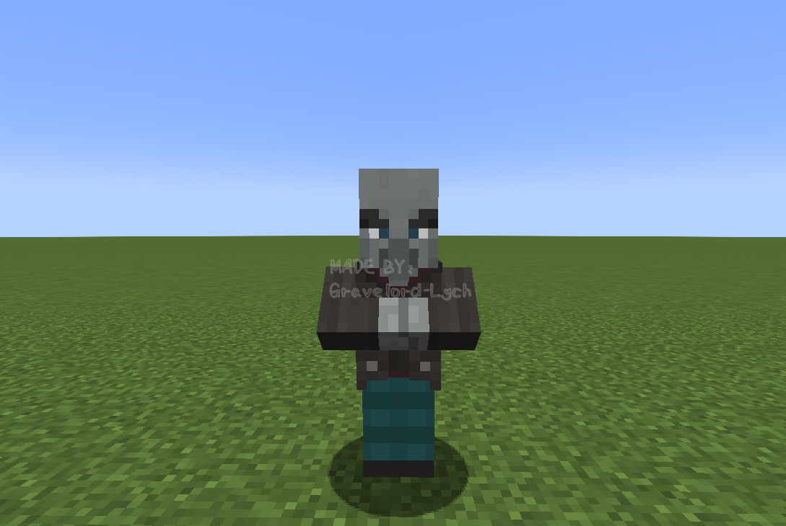
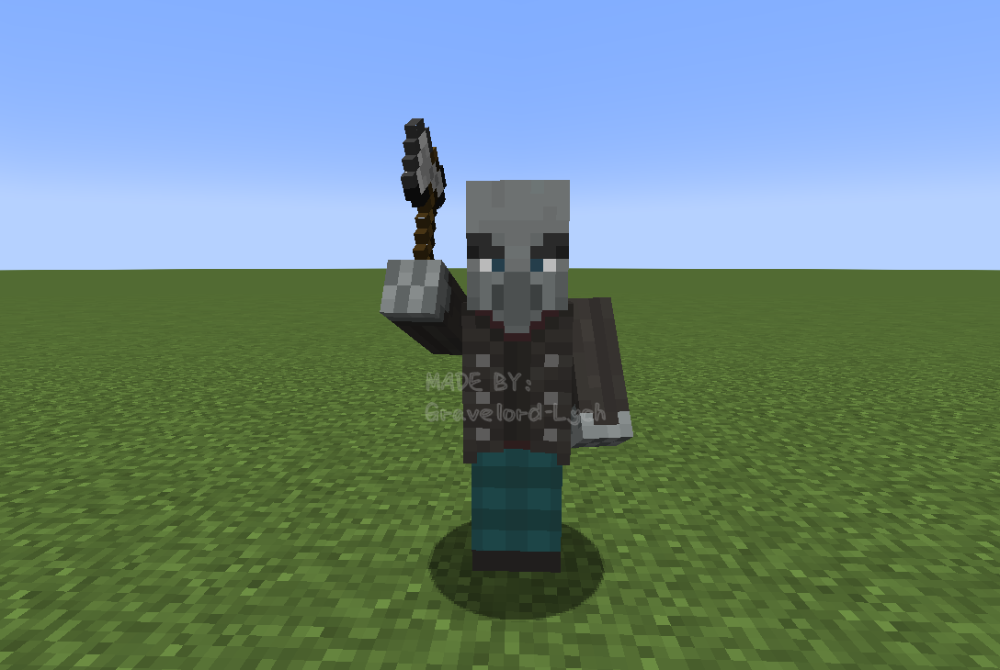
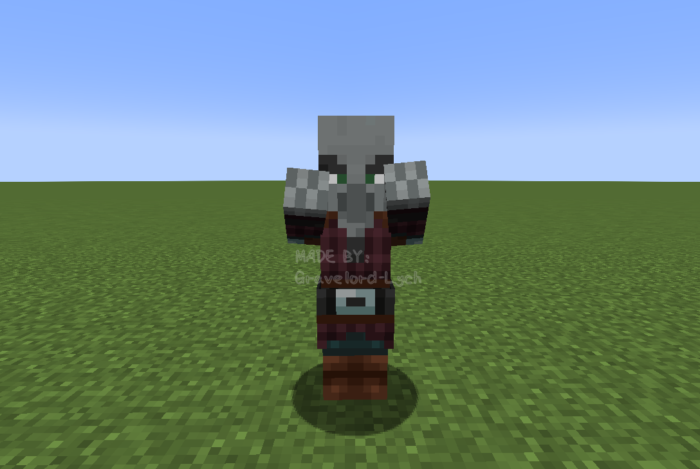
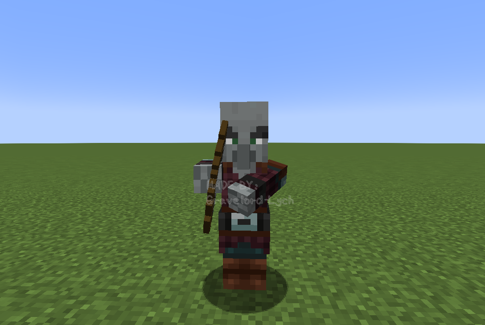
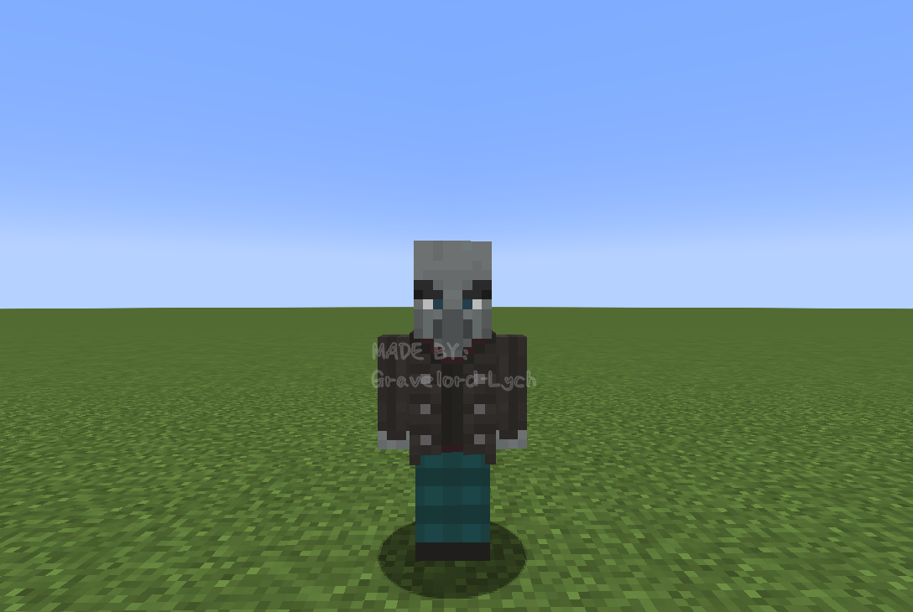

# 灾厄村民的手臂动作

在介绍唤魔者的渲染部分前，先提一下模型方面的一个重要内容。  

`IllagerArmPose`类是`AbstractIllager`类的内部类，定义了灾厄村民所有可能的手臂动作。  
```java
public static enum IllagerArmPose {
    CROSSED,
    ATTACKING,
    SPELLCASTING,
    BOW_AND_ARROW,
    CROSSBOW_HOLD,
    CROSSBOW_CHARGE,
    CELEBRATING,
    NEUTRAL;
}
```
具体根据这些动作调整灾厄村民模型的地方在`IllagerModel`类中的`setupAnim`方法里，该类的其他部分相对容易理解，因此本节不再赘述。  

所有手部动作如下面的图片所示。

### `CROSSED`
`CROSSED`是双手交叉放在胸前的动作。


相关代码（这部分代码在整个`setupAnim`方法的最后面）：
```java
boolean crossedArms = pose == IllagerArmPose.CROSSED;
arms.visible = crossedArms;
leftArm.visible = !crossedArms;
rightArm.visible = !crossedArms;
```

另外`CROSSED`是一个比较特殊的动作，在手臂动作为`CROSSED`状态下，原先的双臂是不渲染的，而是渲染代表“交叉在胸前的双臂”的名称为`arms`的另外一个`ModelPart`。当实体材质上的这个`ModelPart`的相应位置缺失材质时，交叉的手臂是不会渲染的。仔细观察实体材质可以发现掠夺者的材质与卫道士、唤魔者等灾厄村民的材质相比“少一块”，少的这部分就是`arms`对应的材质。因此将掠夺者的手臂动作设置为`CROSSED`时会出现不渲染手臂的现象，如下图所示。    


### `ATTACKING`
当手部动作被设置为`ATTACKING`时，会根据手上有无物品来调整成不同的动作。手上没有物品时则会双臂前伸，摆出类似僵尸攻击的姿势。  

手上有武器时的动作：


手上无武器时的动作：


相关代码：
```java
if (illager.getMainHandItem().isEmpty()) {
    AnimationUtils.animateZombieArms(leftArm, rightArm, true, attackTime, ageInTicks); // 中间的布尔值参数传入true会使手臂抬高，就像僵尸在攻击状态下一样（可以参考1.2.1.1.2节）
} else {
    AnimationUtils.swingWeaponDown(rightArm, leftArm, illager, attackTime, ageInTicks);
}
```

### `SPELLCASTING`
`SPELLCASTING`是灾厄村民施法时使用的动作。


相关代码：
```java
rightArm.z = 0.0F;
rightArm.x = -5.0F;
leftArm.z = 0.0F;
leftArm.x = 5.0F;
rightArm.xRot = Mth.cos(ageInTicks * 0.6662F) * 0.25F;
leftArm.xRot = Mth.cos(ageInTicks * 0.6662F) * 0.25F;
rightArm.zRot = 2.3561945F; // 这里增大zRot的绝对值来上抬手臂，注：2.3561945 = Math.PI * 0.75
leftArm.zRot = -2.3561945F;
rightArm.yRot = 0.0F;
leftArm.yRot = 0.0F;
```

### `BOW_AND_ARROW`
`BOW_AND_ARROW`是灾厄村民使用弓箭进行攻击时的动作。


相关代码：
```java
rightArm.yRot = -0.1F + head.yRot;
rightArm.xRot = (-(float) Math.PI / 2F) + head.xRot;
leftArm.xRot = -0.9424779F + head.xRot; // 注：0.9424779 = Math.PI * 0.3
leftArm.yRot = head.yRot - 0.4F;
leftArm.zRot = ((float) Math.PI / 2F);
```

### `CROSSBOW_HOLD`
`CROSSBOW_HOLD`是灾厄村民手持弩但并未处于装填状态时的动作。


相关代码：
```java
AnimationUtils.animateCrossbowHold(rightArm, leftArm, head, true); // true表示渲染右手持弩时的手部动作，false则为左手
```

### `CROSSBOW_CHARGE`
`CROSSBOW_CHARGE`是灾厄村民装填弩时的动作。


相关代码：
```java
AnimationUtils.animateCrossbowCharge(rightArm, leftArm, illager, true); // true表示渲染右手持弩时的手部动作，false则为左手
```

### `CELEBRATING`
`CELEBRATING`是灾厄村民庆祝袭击（从灾厄村民的角度而言）胜利时的动作。与`SPELLCASTING`的差别在于这时候灾厄村民的手臂姿势不是轴对称的，手臂振幅更小，而且手臂伸得更高。


相关代码：
```java
rightArm.z = 0.0F;
rightArm.x = -5.0F;
rightArm.xRot = Mth.cos(ageInTicks * 0.6662F) * 0.05F;
rightArm.zRot = 2.670354F; // 注：2.670354 = Math.PI * 0.85
rightArm.yRot = 0.0F;
leftArm.z = 0.0F;
leftArm.x = 5.0F;
leftArm.xRot = Mth.cos(ageInTicks * 0.6662F) * 0.05F;
leftArm.zRot = -2.3561945F; // 两个zRot的绝对值不相等，使手臂呈现非对称的姿势
leftArm.yRot = 0.0F;
```

### `NEUTRAL`
`NEUTRAL`是灾厄村民手臂自然下垂时的动作。这是掠夺者手上物品非弩时的默认手臂动作，而卫道士、唤魔者、幻术师的默认手臂动作则为`CROSSED`。


相关代码：
```java
rightArm.xRot = Mth.cos(limbSwing * 0.6662F + (float) Math.PI) * 2.0F * limbSwingAmount * 0.5F;
rightArm.yRot = 0.0F;
rightArm.zRot = 0.0F;
leftArm.xRot = Mth.cos(limbSwing * 0.6662F) * 2.0F * limbSwingAmount * 0.5F;
leftArm.yRot = 0.0F;
leftArm.zRot = 0.0F;
```

最后附上`IllagerModel`类中的整个`setupAnim`方法：
```java
@Override
public void setupAnim(T illager, float limbSwing, float limbSwingAmount, float ageInTicks, float netHeadYaw, float headPitch) {
    head.yRot = netHeadYaw * ((float) Math.PI / 180F);
    head.xRot = headPitch * ((float) Math.PI / 180F);

    if (riding) {
        rightArm.xRot = (-(float) Math.PI / 5F);
        rightArm.yRot = 0.0F;
        rightArm.zRot = 0.0F;
        leftArm.xRot = (-(float) Math.PI / 5F);
        leftArm.yRot = 0.0F;
        leftArm.zRot = 0.0F;
        rightLeg.xRot = -1.4137167F; // 注：1.4137167 = Math.PI * 0.45
        rightLeg.yRot = ((float) Math.PI / 10F);
        rightLeg.zRot = 0.07853982F; // 注：0.07853982 = Math.PI * 0.025
        leftLeg.xRot = -1.4137167F;
        leftLeg.yRot = (-(float) Math.PI / 10F);
        leftLeg.zRot = -0.07853982F;
    } else {
        // NEUTRAL
        rightArm.xRot = Mth.cos(limbSwing * 0.6662F + (float) Math.PI) * 2.0F * limbSwingAmount * 0.5F;
        rightArm.yRot = 0.0F;
        rightArm.zRot = 0.0F;
        leftArm.xRot = Mth.cos(limbSwing * 0.6662F) * 2.0F * limbSwingAmount * 0.5F;
        leftArm.yRot = 0.0F;
        leftArm.zRot = 0.0F;
        // 下面则是腿部动作，所有手臂动作对应的腿部动作都一样
        rightLeg.xRot = Mth.cos(limbSwing * 0.6662F) * 1.4F * limbSwingAmount * 0.5F;
        rightLeg.yRot = 0.0F;
        rightLeg.zRot = 0.0F;
        leftLeg.xRot = Mth.cos(limbSwing * 0.6662F + (float) Math.PI) * 1.4F * limbSwingAmount * 0.5F;
        leftLeg.yRot = 0.0F;
        leftLeg.zRot = 0.0F;
    }

    IllagerArmPose pose = illager.getArmPose();
    // ATTACKING
    if (pose == IllagerArmPose.ATTACKING) {
        if (illager.getMainHandItem().isEmpty()) {
            AnimationUtils.animateZombieArms(leftArm, rightArm, true, attackTime, ageInTicks);
        } else {
            AnimationUtils.swingWeaponDown(rightArm, leftArm, illager, attackTime, ageInTicks);
        }
    } 
    // SPELLCASTING
    else if (pose == IllagerArmPose.SPELLCASTING) {
        rightArm.z = 0.0F;
        rightArm.x = -5.0F;
        leftArm.z = 0.0F;
        leftArm.x = 5.0F;
        rightArm.xRot = Mth.cos(ageInTicks * 0.6662F) * 0.25F;
        leftArm.xRot = Mth.cos(ageInTicks * 0.6662F) * 0.25F;
        rightArm.zRot = 2.3561945F;
        leftArm.zRot = -2.3561945F;
        rightArm.yRot = 0.0F;
        leftArm.yRot = 0.0F;
    }
    // BOW_AND_ARROW 
    else if (pose == IllagerArmPose.BOW_AND_ARROW) {
        rightArm.yRot = -0.1F + head.yRot;
        rightArm.xRot = (-(float) Math.PI / 2F) + head.xRot;
        leftArm.xRot = -0.9424779F + head.xRot;
        leftArm.yRot = head.yRot - 0.4F;
        leftArm.zRot = ((float) Math.PI / 2F);
    } 
    // CROSSBOW_HOLD
    else if (pose == IllagerArmPose.CROSSBOW_HOLD) {
        AnimationUtils.animateCrossbowHold(rightArm, leftArm, head, true);
    } 
    // CROSSBOW_CHARGE
    else if (pose == IllagerArmPose.CROSSBOW_CHARGE) {
        AnimationUtils.animateCrossbowCharge(rightArm, leftArm, illager, true);
    } 
    // CELEBRATING
    else if (pose == IllagerArmPose.CELEBRATING) {
        rightArm.z = 0.0F;
        rightArm.x = -5.0F;
        rightArm.xRot = Mth.cos(ageInTicks * 0.6662F) * 0.05F;
        rightArm.zRot = 2.670354F;
        rightArm.yRot = 0.0F;
        leftArm.z = 0.0F;
        leftArm.x = 5.0F;
        leftArm.xRot = Mth.cos(ageInTicks * 0.6662F) * 0.05F;
        leftArm.zRot = -2.3561945F;
        leftArm.yRot = 0.0F;
    }

    // CROSSED
    boolean crossedArms = pose == IllagerArmPose.CROSSED;
    arms.visible = crossedArms;
    leftArm.visible = !crossedArms;
    rightArm.visible = !crossedArms;
}
```

本节的内容到这里就结束了，接下来将会分析唤魔者的渲染。